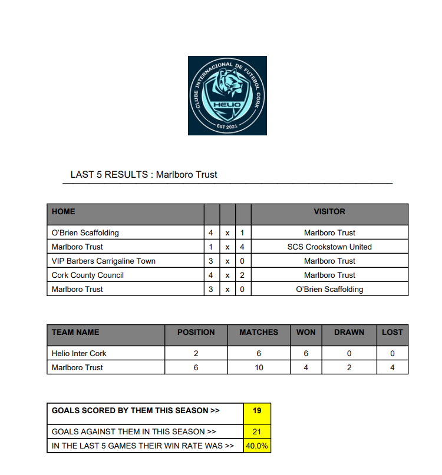
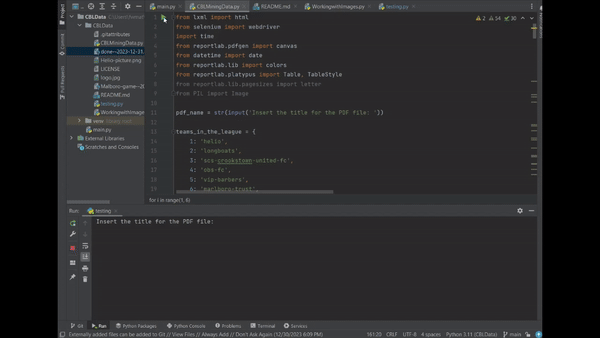

# CBLData 📊
 
Welcome to Project CBLData!

Project CBLData aims to assist in the development of a league statistic. In its initial phase, the goal is to establish an easy-to-use method for observing data from a website, allowing users to visualize information without navigating to the web.

The primary objective is to showcase the power and usefulness of data mining, illustrating how it can empower teams to continuously improve their performance in each game.

The main functionality involves generating PDF reports containing the latest results of teams. This enables teams to review recent outcomes, compare victories and losses with other teams, and evaluate their own performance.

Example of a PDF:

Example of a usability:

Libraries utilized in the project so far include:

- lxml
- selenium
- time
- reportlab

I will describe the reasons behind the selection of each library step by step. If you find the concept intriguing, please let me know!

I successfully employed lxml and Selenium for web scraping, effectively gathering the required data from the web browser. Leveraging the robust features of these tools, I seamlessly extracted and processed the desired information.
As for the PDF generation, I utilized the reportlab library, finding it to be an excellent and user-friendly tool for creating high-quality PDF reports. I appreciate its capabilities and look forward to incorporating it into future projects.
